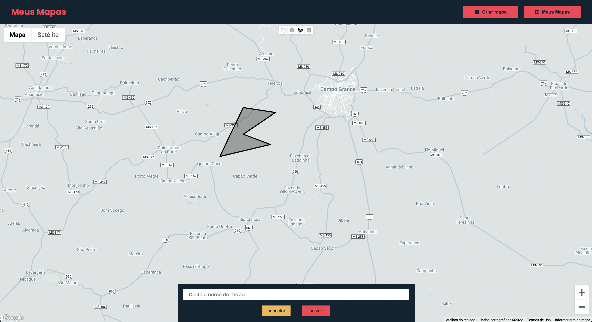
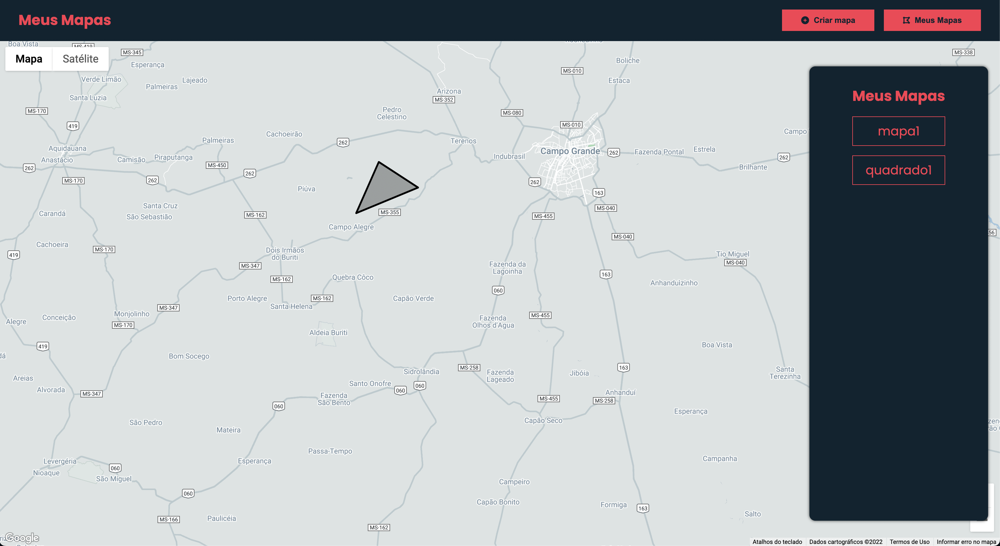

# Shapes in Google Maps API Challenge

## Desafio

- O desafio era criar uma aplicação para consumir a api do google maps java script
- Na aplicação o usuário pudesse criar um desenho, um shape ou uma forma
- O usuario poderia salvar seu denho
- A aplicação teria que listar os desenhos salvos pelo usuário
- ao clicar no desenho da lista, a aplicação deveria mostrar o desnho salvo.

## Layout 
- Como o intuito do desafio era consumir a API, foi criado um layout simples.
- O layout esta adaptado apenas para desktop

## Referencias

- Documentação : https://developers.google.com/maps/documentation/javascript/shapes#polygon_add
- Alem da documentação foi consumido alguns videos no youtube para melhor entendimento da API

## Screenshots

- Home

-

- Desenhando Shape

- Imagem de Satelite

- Listando shapes

